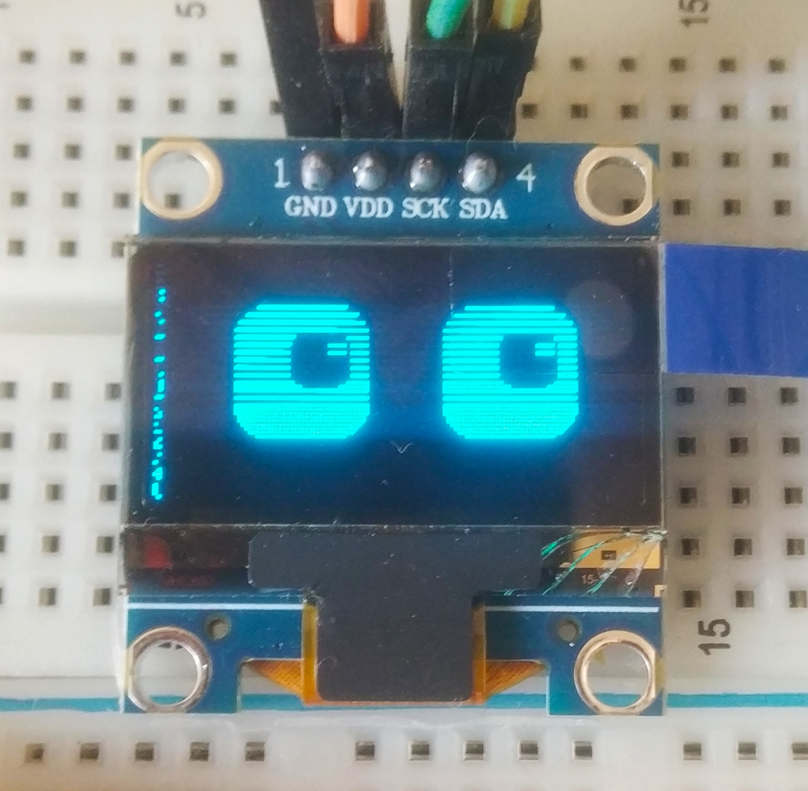

# 🤖 Blinky - Interactive Desk Companion

<div align="center">
  
  
  [](https://opensource.org/licenses/MIT)
  [](https://www.espressif.com/en/products/socs/esp32)
  [](https://www.arduino.cc/)
  
  **An expressive IoT desk companion with animated eyes, weather tracking, and personality**
</div>

---

## 📖 Table of Contents

- [Overview](#overview)
- [Features](#features)
- [Hardware Requirements](#hardware-requirements)
- [Software Requirements](#software-requirements)
- [Wiring Diagram](#wiring-diagram)
- [Installation](#installation)
- [Configuration](#configuration)
- [Usage](#usage)
- [Technical Details](#technical-details)
- [Troubleshooting](#troubleshooting)
- [Contributing](#contributing)
- [License](#license)
- [Acknowledgments](#acknowledgments)

---

## 🎯 Overview

Blinky is an interactive desk companion built on ESP32 that displays emotions through animated eyes, shows real-time weather, and cycles through useful information displays. The robot's mood adapts to weather conditions, creating an engaging and personality-driven user experience.

**Demo Video:** [Watch Blinky in action](#) *(https://www.instagram.com/reel/DXYRshMCtBS/?utm_source=ig_web_copy_link&igsh=MzRlODBiNWFlZA==)*

---

## ✨ Features

### 🎭 **Expressive Animations**
- **9 Emotional States:** Normal, Happy, Surprised, Sleepy, Angry, Sad, Excited, Love, Suspicious
- **Realistic Eye Physics:** Spring-damper system for natural movement
- **Autonomous Behaviors:** Random blinking, gaze tracking, breathing animations
- **Mood Particles:** Hearts, Z's, and anger symbols

### 🌤️ **Weather Integration**
- Real-time weather updates via OpenWeatherMap API
- Temperature, humidity, and "feels like" display
- 3-day weather forecast
- Weather-based mood adaptation

### ⏰ **Information Display**
- Current time with AM/PM (12-hour format)
- Date display with day of week
- World clock (configurable timezones)
- Auto-rotating pages every 8 seconds

### 🎮 **Interaction**
- **Single Tap:** Skip to next page
- **Double Tap:** Toggle brightness
- **Long Press:** Change mood (on emotion page)

### 🔧 **Configuration**
- WiFi setup via captive web portal
- Easy timezone configuration
- Custom city/country selection
- Factory reset option

---

## 🛠️ Hardware Requirements

| Component | Specification | Quantity |
|-----------|--------------|----------|
| **Microcontroller** | ESP32 Development Board | 1 |
| **Display** | SH1106 OLED 128x64 (I2C, 4-pin) | 1 |
| **Touch Sensor** | Capacitive Touch Sensor / Button | 1 |
| **Power Supply** | 5V USB or Battery | 1 |
| **Wires** | Jumper wires | 4-6 |

### 💰 Estimated Cost
- **Total:** $10-15 USD (varies by region)

---

## 📚 Software Requirements

### **Arduino IDE Setup**

1. **Install Arduino IDE** (v1.8.19 or newer)
   - Download from: https://www.arduino.cc/en/software

2. **Install ESP32 Board Support**
   - Open Arduino IDE
   - Go to `File → Preferences`
   - Add to "Additional Board Manager URLs":https://dl.espressif.com/dl/package_esp32_index.json
   - Go to `Tools → Board → Boards Manager`
   - Search "ESP32" and install "esp32 by Espressif Systems"

3. **Install Required Libraries**
   
   Go to `Sketch → Include Library → Manage Libraries` and install:
   
   | Library | Version | Purpose |
   |---------|---------|---------|
   | Adafruit GFX Library | Latest | Graphics primitives |
   | Adafruit SH110X | Latest | OLED driver |
   | Arduino_JSON | Latest | Weather API parsing |
   | WiFi (Built-in) | - | Network connectivity |
   | WebServer (Built-in) | - | Config portal |
   | Preferences (Built-in) | - | Settings storage |
   | HTTPClient (Built-in) | - | API requests |

---

## 🔌 Wiring Diagram

### **Connection Table**

| ESP32 Pin | Component | OLED Pin | Notes |
|-----------|-----------|----------|-------|
| **3.3V** | OLED | VCC | Power (do NOT use 5V) |
| **GND** | OLED | GND | Ground |
| **GPIO 21** | OLED | SDA | I2C Data |
| **GPIO 22** | OLED | SCL | I2C Clock |
| **GPIO 15** | Touch Sensor | Signal | Capacitive touch input |
| **GND** | Touch Sensor | GND | Ground |

### **Important Notes:**
- ⚠️ **Use 3.3V for OLED, NOT 5V** (will damage display)
- ⚠️ **No RST pin connection needed** (4-pin OLED variant)
- ✅ Pull-up resistors (usually built-in on ESP32 I2C pins)
- ✅ Touch sensor can be replaced with a simple push button

---

## 📥 Installation

### **Step 1: Hardware Assembly**
1. Connect components according to the wiring diagram
2. Double-check all connections (especially 3.3V vs 5V)
3. Ensure OLED is firmly seated

### **Step 2: Get OpenWeatherMap API Key**
1. Sign up at https://openweathermap.org/
2. Go to API Keys section
3. Copy your API key (free tier works fine)

### **Step 3: Upload Code**

1. **Clone this repository:**
```bash
   git clone https://github.com/yourusername/blinky-desk-companion.git
   cd blinky-desk-companion
```

2. **Open in Arduino IDE:**
File → Open → blinky.ino

3. **Select Board:**
Tools → Board → ESP32 Arduino → ESP32 Dev Module

4. **Select Port:**
Tools → Port → (Select your ESP32 COM port)

5. **Upload Settings:**
Tools → Upload Speed → 115200
Tools → Flash Frequency → 80MHz
Tools → Partition Scheme → Default 4MB

6. **Upload:**
   - Click the **Upload** button (→)
   - Wait for "Done uploading" message

---

## ⚙️ Configuration

### **First-Time Setup**

1. **Power on Blinky**
   - Display should show "BOOT OK" then initialization messages

2. **Enter Config Mode** (two methods):
   
   **Method A:** First boot (no WiFi saved)
   - Device automatically creates WiFi hotspot
   
   **Method B:** Manual trigger
   - Hold touch button for 5 seconds during boot screen

3. **Connect to WiFi Hotspot:**
   - Network Name: `Embedded-Roshan`
   - Password: `12345678`

4. **Open Configuration Page:**
   - Open browser and go to: `http://192.168.4.1`
   - You should see the configuration interface

5. **Enter Your Settings:**

   | Field | Example | Description |
   |-------|---------|-------------|
   | **WiFi SSID** | `MyHomeWiFi` | Your WiFi network name |
   | **WiFi Password** | `********` | Your WiFi password |
   | **API Key** | `abc123...` | OpenWeatherMap API key |
   | **City** | `London` | Your city name |
   | **Country Code** | `GB` | 2-letter country code |
   | **Timezone** | `GMT0BST,M3.5.0/1,M10.5.0` | POSIX timezone string |

6. **Save & Reboot:**
   - Click "Save & Reboot"
   - Device will restart and connect to WiFi

### **Timezone String Examples**

| Location | Timezone String |
|----------|----------------|
| **India (IST)** | `IST-5:30` |
| **New York (EST/EDT)** | `EST5EDT,M3.2.0,M11.1.0` |
| **London (GMT/BST)** | `GMT0BST,M3.5.0/1,M10.5.0` |
| **Sydney (AEST/AEDT)** | `AEST-10AEDT,M10.1.0,M4.1.0/3` |
| **Los Angeles (PST/PDT)** | `PST8PDT,M3.2.0,M11.1.0` |

More timezones: https://github.com/nayarsystems/posix_tz_db/blob/master/zones.csv

### **Factory Reset**

To completely reset Blinky:
1. Power on device
2. **Hold touch button for 5 seconds** during "Hold 5s for factory reset" screen
3. All settings will be erased
4. Device restarts in config mode

---

## 🎮 Usage

### **Page Navigation**

Blinky automatically cycles through 5 pages every 8 seconds:

| Page # | Name | Description |
|--------|------|-------------|
| **0** | Emotion Face | Animated eyes with current mood |
| **1** | Clock | Current time and date |
| **2** | Weather | Temperature, humidity, conditions |
| **3** | World Clock | India & Sydney time (customizable) |
| **4** | Forecast | 3-day weather forecast |

### **Touch Controls**

| Gesture | Action | Details |
|---------|--------|---------|
| **Single Tap** | Next Page | Skip to next page immediately |
| **Double Tap** | Brightness | Toggle between bright/dim |
| **Long Press** | Change Mood | Cycles through 9 moods (Page 0 only) |

### **Mood States**

| Mood | Trigger | Appearance |
|------|---------|------------|
| **Normal** | Default | Neutral expression |
| **Happy** | Clear weather | Wide eyes, cheek push |
| **Sad** | Rain/Drizzle | Droopy eyes |
| **Surprised** | Thunderstorm | Wide open eyes |
| **Sleepy** | Manual | Half-closed eyes, Z's |
| **Angry** | Manual | Slanted eyes, anger marks |
| **Excited** | Temp > 25°C | Energetic eyes |
| **Love** | Manual | Hearts floating |
| **Suspicious** | Manual | One eye squint |

---

## 🔬 Technical Details
### **Physics Engine**

Blinky uses a **spring-damper physics system** for realistic eye movement:

```cpp
// Hooke's Law + Damping
acceleration = (target - current) * spring_constant
velocity = (velocity + acceleration) * damping
position += velocity
```

**Parameters:**
- **Eye Spring (k):** 0.12 - Controls responsiveness
- **Eye Damping (d):** 0.60 - Prevents oscillation
- **Pupil Spring (pk):** 0.08 - Slower, lagging motion
- **Pupil Damping (pd):** 0.50 - Smooth secondary motion

This creates a natural "follow-through" effect where pupils lag slightly behind eye movement.

### **Memory Usage**

| Component | Flash (ROM) | RAM |
|-----------|-------------|-----|
| Code | ~450 KB | - |
| Fonts | ~45 KB | - |
| Bitmaps | ~8 KB | - |
| Runtime Variables | - | ~12 KB |
| Display Buffer | - | ~1 KB |
| **Total** | **~503 KB** | **~13 KB** |

ESP32 has 4MB Flash and 520KB RAM - plenty of headroom for expansion!

### **API Update Intervals**

| Feature | Update Frequency | Reason |
|---------|------------------|--------|
| Weather | 10 minutes | API rate limits |
| Time (NTP) | On boot only | RTC maintains accuracy |
| Display | ~60 FPS | Smooth animations |
| Touch | 50ms polling | Responsive input |

### **Power Consumption**

| State | Current Draw | Power (5V) |
|-------|-------------|------------|
| Active (Bright) | ~150 mA | 0.75 W |
| Active (Dim) | ~80 mA | 0.40 W |
| Idle | ~70 mA | 0.35 W |

Battery life estimates (with 2000mAh battery):
- Bright mode: ~13 hours
- Dim mode: ~25 hours

---

## 🐛 Troubleshooting

### **Display Issues**

| Problem | Possible Cause | Solution |
|---------|---------------|----------|
| **OLED not turning on** | Wrong voltage | Use 3.3V, NOT 5V |
| **Garbled display** | I2C address mismatch | Check if 0x3C or 0x3D |
| **Display freezes** | Software crash | Check Serial Monitor for errors |
| **Blank screen after boot** | Init timing issue | Power cycle, hold touch for config |

**Debug Steps:**
1. Open Serial Monitor (115200 baud)
2. Look for "OLED detected at 0x3C"
3. If not detected, check wiring
4. Try I2C scanner sketch to verify address

### **WiFi Issues**

| Problem | Solution |
|---------|----------|
| **Can't connect to config portal** | Check if "Embedded-Roshan" WiFi appears |
| **WiFi connection fails** | Verify SSID/password, check signal strength |
| **Loses connection** | Router may be dropping ESP32, try static IP |
| **Can't save config** | Check Serial Monitor for errors |

### **Weather Issues**

| Problem | Solution |
|---------|----------|
| **Shows "Loading"** | Check API key, verify internet connection |
| **Wrong city** | Ensure city name spelling, add country code |
| **No forecast data** | API may be down, wait and retry |
| **HTTP Error 401** | Invalid API key |

### **Touch Sensor Issues**

| Problem | Solution |
|---------|----------|
| **No response** | Check GPIO15 connection |
| **Overly sensitive** | Add 1MΩ resistor to ground |
| **Random triggers** | Add 100nF capacitor to ground |

### **Serial Monitor Commands**

Monitor output at **115200 baud** for diagnostic info:
- Boot sequence details
- WiFi connection status
- API request/response data
- Error messages

---

## 🤝 Contributing

Contributions are welcome! Here's how you can help:

### **Ways to Contribute**

1. **🐛 Bug Reports**
   - Open an issue with detailed description
   - Include Serial Monitor output
   - Specify hardware variant

2. **✨ Feature Requests**
   - Suggest new moods/animations
   - Propose additional display pages
   - Request new integrations

3. **💻 Code Contributions**
   - Fork the repository
   - Create a feature branch
   - Submit a pull request

4. **📚 Documentation**
   - Improve README
   - Add tutorials
   - Create video guides

### **Development Setup**

```bash
# Fork and clone
git clone https://github.com/yourusername/blinky-desk-companion.git

# Create feature branch
git checkout -b feature/amazing-feature

# Make changes and test

# Commit
git commit -m "Add amazing feature"

# Push
git push origin feature/amazing-feature

# Open Pull Request on GitHub
```

### **Code Style Guidelines**

- Use descriptive variable names
- Comment complex logic
- Follow existing formatting
- Test on hardware before PR

---

## 📜 License

This project is licensed under the **MIT License** - see the [LICENSE](LICENSE) file for details.

### MIT License Summary

✅ **Permitted:**
- Commercial use
- Modification
- Distribution
- Private use

❌ **Limitations:**
- No liability
- No warranty

📋 **Conditions:**
- Include license and copyright notice

---

## 🙏 Acknowledgments

### **Libraries Used**
- [Adafruit GFX](https://github.com/adafruit/Adafruit-GFX-Library) - Graphics core
- [Adafruit SH110X](https://github.com/adafruit/Adafruit_SH110x) - OLED driver
- [Arduino_JSON](https://github.com/arduino-libraries/Arduino_JSON) - JSON parsing

### **APIs & Services**
- [OpenWeatherMap](https://openweathermap.org/) - Weather data
- [NTP Pool](https://www.pool.ntp.org/) - Time synchronization

### **Inspiration**
- Classic virtual pet devices (Tamagotchi, Digimon)
- Desktop companion apps
- Maker community projects

### **Special Thanks**
- ESP32 community for extensive documentation
- Arduino forum contributors
- Everyone who provided feedback and testing

---

## 📞 Contact & Support

- **Author:** [Roshan Chavan]
- **GitHub:** [@RoshanWithEmbedded](https://github.com/yourusername)
- **Project Issues:** [GitHub Issues](https://github.com/RoshanWithEmbedded/blinky/issues)
- **Discussions:** [GitHub Discussions](https://github.com/yourusername/blinky/discussions)

---

## 🗺️ Roadmap

### **Planned Features**

- [ ] **v2.0 - Enhanced Connectivity**
  - [ ] MQTT support for home automation
  - [ ] Google Calendar integration
  - [ ] Notification display

- [ ] **v2.1 - More Personalities**
  - [ ] 5 additional moods
  - [ ] Customizable mood triggers
  - [ ] Mood scheduling

- [ ] **v2.2 - Hardware Upgrades**
  - [ ] RGB LED support
  - [ ] Speaker for sound effects
  - [ ] Battery level indicator

- [ ] **v3.0 - Mobile App**
  - [ ] iOS/Android companion app
  - [ ] Remote configuration
  - [ ] Push notifications

### **Community Requests**
Vote on features in [GitHub Discussions](https://github.com/yourusername/blinky-desk-companion/discussions)!

---

## 📸 Gallery

<div align="center">
  
### Different Moods


### Weather Display


### Hardware Setup


</div>

---

## 📊 Project Stats


---

<div align="center">
  
**⭐ If you found this project helpful, please consider giving it a star!**

Made with ❤️ and lots of ☕

</div>

